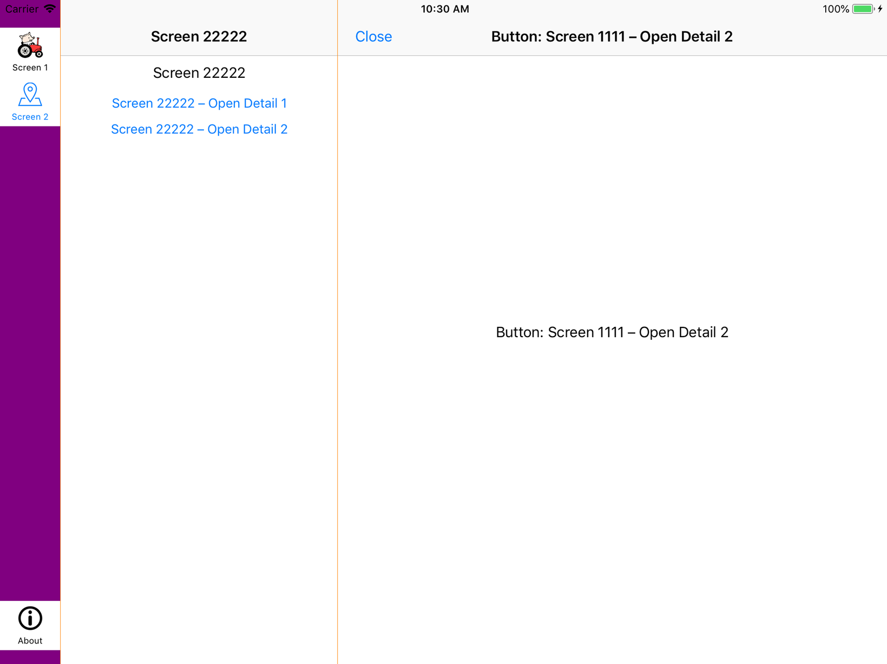
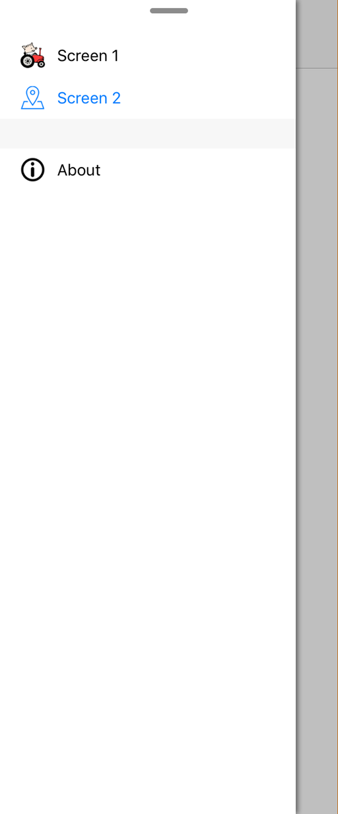
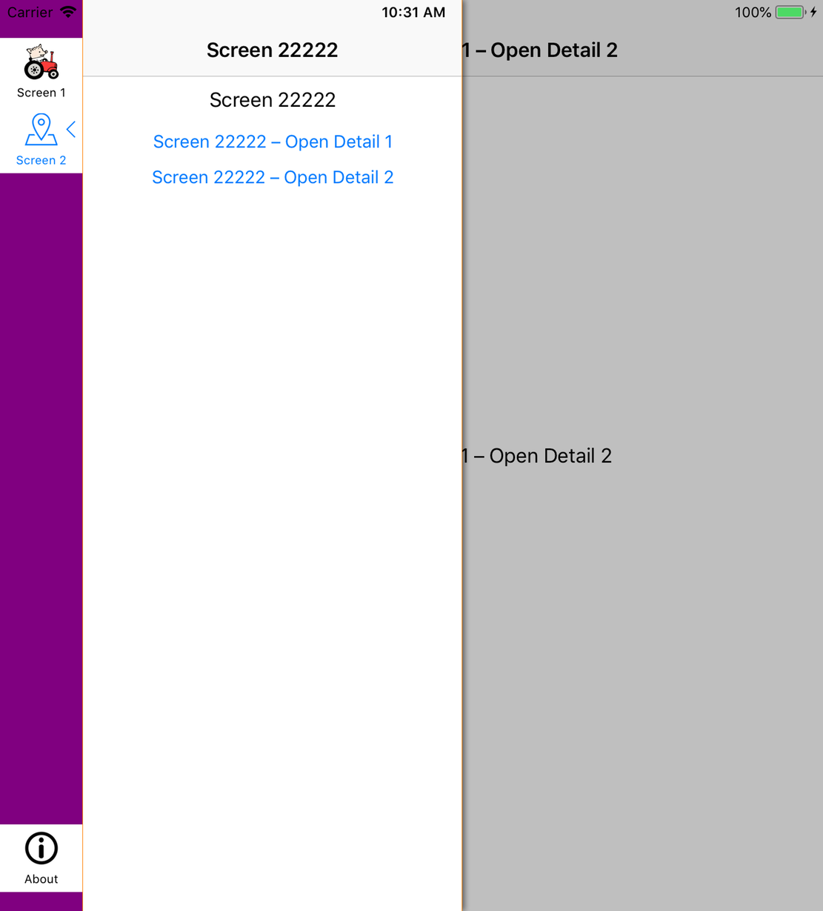

# PKTabbedSplitViewController
Inspired by [SMTabbedSplitViewController](https://github.com/sergik-ru/SMTabbedSplitViewController) but written in Swift and works also on iPhone

Currently upder development.

If you're interested in the project, you can create an issue or add a PR. You can find all currently planned changes and known bugs in the [TODO.txt](TabbedSplitViewControllerDemo/TODO.txt) file. 

### Screenshot from the current Demo app:
#### Full screen

#### Split screen

1/3 and 2/3 screen:

 | 
